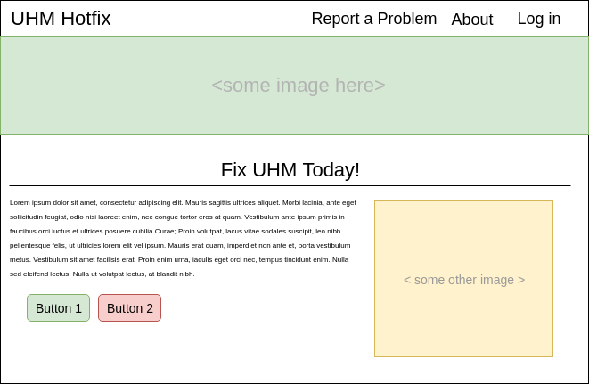

# UHM Hotfix

UHM Hotfix is a web application that allows students to report suggestions or problems they find on campus in ten seconds or less. 

## features

<ul>
 <li> Lightning fast, simple to use interface.</li>
 <li> Use of geolocation to automatically identify the location of the issue</li>
 <li> Real-time feed of new  problems and suggestions</li>
 <li> An Admin interface to manage problems and suggestions.
</ul>

